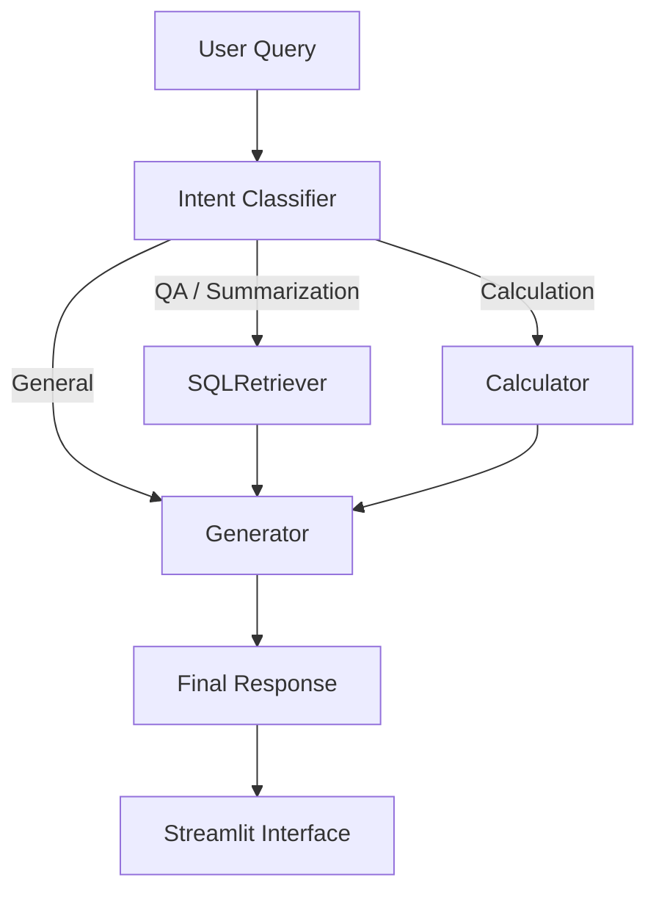

# SMART OFFER REPORT ASSISTANT 🤖

A lightweight **LLM-powered assistant** for analyzing and querying retail offer data.

The system supports:

- Natural language database search
- Mathematical calculations
- Offer data summarization
- Conversational interaction

The project integrates **Streamlit + LangGraph + Azure OpenAI + SQL + Vector Search** to provide an interactive AI-powered data analysis assistant.

---

# System Highlights

- 🧠 **Intent-aware AI Agent**
- 🔎 **Natural language SQL search**
- 🧮 **Secure mathematical calculator**
- 📊 **SQL + Vector hybrid retrieval**
- 💬 **Conversation memory**
- ⚡ **Query caching optimization**
- 🧩 **LangGraph workflow orchestration**
- 🖥 **Interactive Streamlit interface**

---

# System Architecture

The assistant is implemented as a **LangGraph AI Agent workflow**.



Main technologies:

### Frontend
- Streamlit

### Backend
- LangGraph
- Azure OpenAI
- SQLite
- FAISS Vector Search
- LangChain

---

# Project Structure

```
project/
│
├── csv_search.py          # Streamlit frontend interface
├── llm.py                 # LangGraph agent backend
├── offer_db.sqlite        # SQLite database
├── csv_searcher.png       # Graph workflow visualization (auto-generated)
│
├── .env                   # Environment variables
└── README.md
```

---

# Features

## 1 Natural Language Database Search

Users can query the database using natural language.

Example:

```
Retrieve all offers containing 'KFC'
```

The system automatically:

1. Detects user intent
2. Generates SQL queries
3. Retrieves relevant offers
4. Ranks results using vector similarity

---

## 2 Mathematical Calculation

A built-in calculator evaluates arithmetic expressions.

Example:

```
(500 - 120) * 0.9
```

Supported operators:

```
+  -  *  /  ( )
```

---

## 3 Offer Data Summarization

Users can request summaries of offer data.

Example:

```
Provide a summary of the current offer data
```

The LLM analyzes retrieved data and produces a concise summary.

---

# Agent Workflow (LangGraph)

The backend agent uses a **state-based workflow** implemented with LangGraph.

Main nodes:

| Node | Description |
|-----|------|
| classify | Identify user intent |
| retrieve | Query SQL database |
| calculate | Execute calculator tool |
| generate | Generate final answer |

Routing logic:

```
classify
  │
  ├─ calculation → calculate → generate
  │
  ├─ qa / summarization → retrieve → generate
  │
  └─ general → generate
```

Benefits of using **LangGraph**:

- Explicit workflow structure
- Stateful execution
- Tool orchestration
- Easy extensibility

---

# Conversation Memory

The assistant maintains **two levels of memory**.

## UI Memory

Stored in:

```
st.session_state.history
```

Used for displaying chat history in the Streamlit interface.

---

## Agent Memory

Stored in:

```
agent_history
```

This history is passed to the LangGraph workflow so the LLM can access previous interactions.

Benefits:

- Multi-turn conversation
- Context-aware responses
- Follow-up question support

---

# Query Cache Optimization

To reduce repeated computation, the system implements **query caching**.

If the same query appears again:

```python
for h in agent_history:
    if h.get("query") == query:
        return h
```

The cached result is returned immediately.

Benefits:

- Faster response time
- Reduced LLM cost
- Better user experience

---

# Retrieval Optimization (SQL + Vector Search)

After retrieving offers from SQL, results are **re-ranked using vector similarity search**.

Workflow:

```
SQL Retrieval
↓
Offer Text Extraction
↓
Embedding Generation
↓
FAISS Similarity Search
↓
Ranked Results
```

Embeddings are generated using **Azure OpenAI embedding models**.

This improves relevance when multiple offers match a query.

---

# Security Design

The calculator tool includes a **security filter** to prevent code injection.

Allowed characters:

```
0-9 + - * / ( )
```

Example validation:

```python
if not re.match(r"^[0-9+\-*/().\s]+$", expression):
```

Calculations are executed using **simpleeval** instead of Python `eval()`.

Benefits:

- Prevents arbitrary code execution
- Safer expression evaluation

---

# Installation

## 1 Install dependencies

```bash
pip install streamlit
pip install pandas
pip install python-dotenv
pip install langchain
pip install langchain-openai
pip install langchain-community
pip install langgraph
pip install simpleeval
pip install faiss-cpu
```

---

## 2 Configure environment variables

Create a `.env` file:

```
OPENAI_API_KEY=your_key

AZURE_OPENAI_CHAT_DEPLOYMENT_NAME=your_chat_model
AZURE_OPENAI_API_VERSION=2024-xx-xx

text-embedding_3_large_deployment=your_embedding_model
text-embedding_3_large_api_version=2024-xx-xx
```

---

# Running the Application

Start the Streamlit interface:

```bash
streamlit run csv_search.py
```

Open the browser:

```
http://localhost:8501
```

---

# Example Queries

### Database Search

```
Retrieve all offers containing 'KFC'
```

### Calculation

```
129 * 0.85
```

### Offer Summary

```
Provide a summary of the current offer data
```

---

# Workflow Visualization

The LangGraph workflow diagram is automatically exported:

```
csv_searcher.png
```

This helps visualize the internal agent execution process.

---

# Use Cases

This system can be adapted for:

- Retail promotion analysis
- Marketing campaign search
- Business intelligence assistants
- Internal data exploration tools
- AI-powered reporting systems

---

# Future Improvements

Possible extensions include:

- CSV file upload support
- RAG document retrieval
- SQL query explanation
- Hybrid retrieval (SQL + vector + keyword search)
- More agent tools
- Persistent long-term memory

---

# License

This project is intended for **educational and research purposes**.